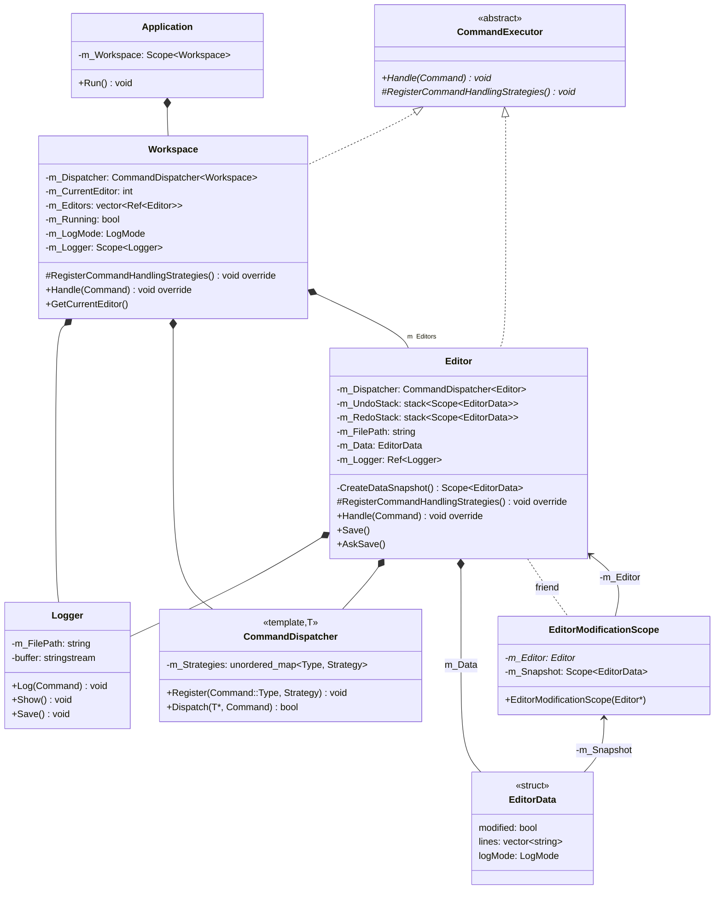
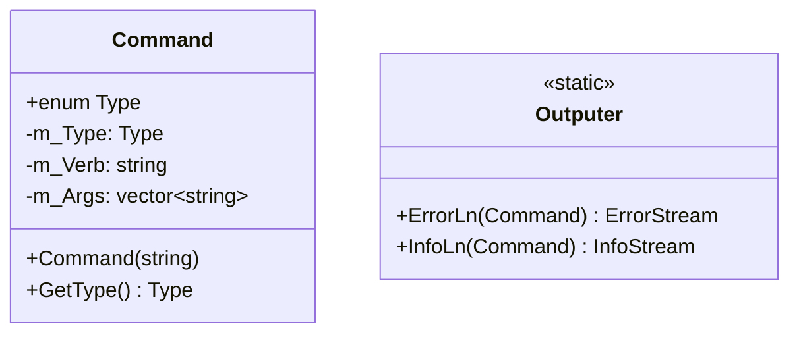
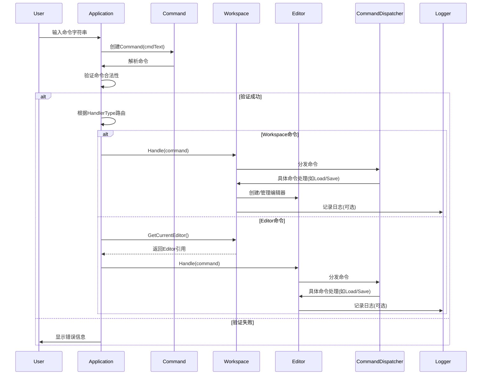
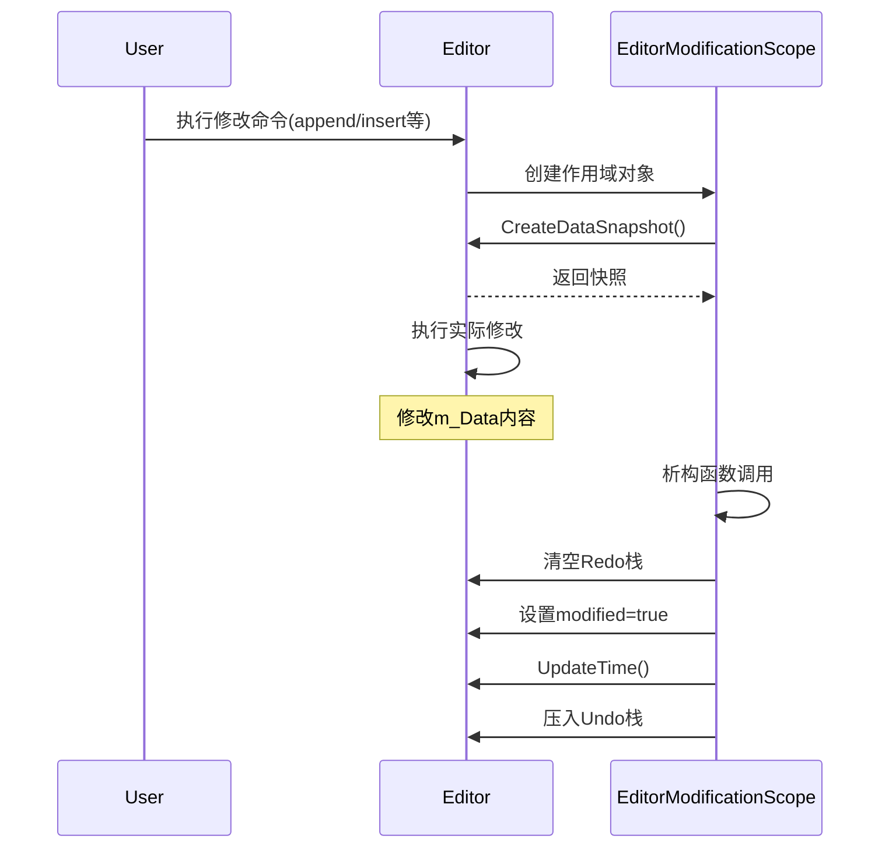
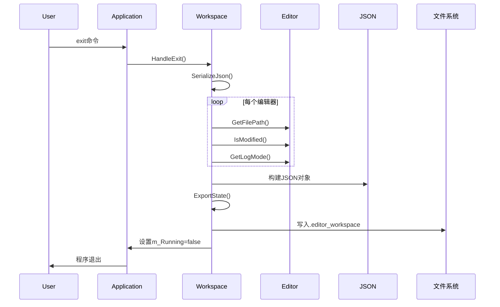

# Lab 1 命令行文本编辑器
王秭研 24302010023<br>实验文档

## 使用与构建方法

### 如何运行
Windows：运行`cmake-build-release/CMDLineTextEditor/CMDLineTextEditor.exe`
其他平台：敬请自行编译（见下）

### 如何构建与编译

#### 依赖项：
- cmake (version >= 3.20)
- git (开发时使用2.47.1.windows.1)
- GNU Make (开发时使用 4.4.1)
- 适用于C++17的编译器（开发时使用g++ (x86_64-posix-seh-rev0) 15.2.0）

#### 构建方法：

克隆GitHub仓库：（或者直接解压压缩包）
```bash
git clone https://github.com/LC-Player/DesignPatternLab
cd DesignPatternTextEditorLab
```

选择你喜欢的C++工具链，通过CMake构建与编译，比如使用gmake：

``` 
cmake .. -DCMAKE_BUILD_TYPE=Release -G "MinGW Makefiles"
make
```

然后运行：<br>`./build/CMDLineTextEditor/CMDLineTextEditor.exe`<br>或者用：<br>`./build/CMDLineTextEditor/CMDLineTextEditorTest.exe`<br>进行测试。

> 也可以用CLion（我的开发环境）、Visual Studio等支持CMake项目的IDE直接打开DesignPatternTextEditorLab文件夹，会自动检测CMakeLists，然后使用IDE集成的工具链构建运行。

> 已确认可使用的工具链：CLion、MinGW Makefiles、Visual Studio 2022、Unix Makefiles。
已确认可正确编译的平台：Windows和Linux。

## 架构说明

整个编辑器大致由Workspace、Editor两个组件组成，这两个组件都继承**CommandExecutor**。Application通过Command对象传递命令给CommandExecutor，CommandExecutor通过注册CommandHandlingStrategies，来选择处理命令的方法，并调用Logger记录操作。

Editor支持撤销和恢复操作，使用储存其信息（EditorData）撤销栈和恢复栈储存快照，然后在涉及修改的Handler中，通过利用RAII特性的EditorModificationScope调用。

项目采用nlohmannjson库来将Workspace和Editor的信息序列化为json文件，以实现持久化储存。

### 核心类关系图




### 时序图

#### 1. 应用启动和命令处理流程


#### 2. 编辑器修改操作流程


#### 3. 工作区状态持久化流程


### 模块职责

- **Application**：负责初始化程序主要部分，实现主循环（Application::Run）（运用CLI Loop设计）。

    在Run方法中，以处理一次命令为一次循环，负责读取命令，初始化Command对象，验证Command对象合法性，然后分发给Workspace或Editor，最后根据Workspace的运行情况判读是否继续循环。

- **Command**：在多个层之间传递信息的媒介，负责从字符串中解析Command，提供验证Command合法性的方法

- **CommandExecuting**：包含
    - CommandExecutor：能够处理Command的对象。由Workspace和Editor实现。
    - CommandDispatcher：组合在CommandExecutor中，注册并分发Command处理
    - GetExecutorFromType：获得Command执行者的辅助函数。


- **Editor**：接收编辑器命令并处理，聚合撤销重做功能，调用Logging模块记录操作。
    - **EditorModificationScope**：RAII型的修改范围指示类型。在涉及修改Editor的命令处理策略中，在修改前初始化EditorModificationScope，拍摄快照，然后在作用域后，对象析构，调用析构函数，自动储存快照并修改部分成员变量。
    - 在实际中使用宏定义`MODIFICATION_SCOPE`快捷操作。
- **Workspace**：接收工作区命令并处理，并调用Workspace处理一些操作。管理Editor的引用。调用Logging模块记录操作。负责在退出时序列化Editor和Workspace内容到文件。管理m_Running信号。
- **Logging**：管理组件的日志内容，负责初始化日志、将日志保存到文件，在组件调用Save方法时更新日志。

- **Outputer**：静态输出类，简单包装std::cout，并结合RAII，提供对命令相关的信息或警告的静态方法。

## 设计模式分析

### （基于函数指针的）策略模式

```cpp
template<typename T>
class CommandDispatcher {
public:
    using Strategy = bool (T::*)(const Command&); 
    
    void Register(Command::Type type, Strategy strategy) {
        m_Strategies[type] = strategy;
    }
    
    bool Dispatch(T* obj, const Command& command) {
        auto it = m_Strategies.find(command.GetType());
        return (obj->*(it->second))(command);
    }
};
```

注册机制：
```cpp
void Editor::RegisterCommandHandlingStrategies() override {
    m_Dispatcher.Register(Command::Type::Append, &Editor::HandleAppend);
    m_Dispatcher.Register(Command::Type::Insert, &Editor::HandleInsert);
    m_Dispatcher.Register(Command::Type::Delete, &Editor::HandleDelete);
    // ... other handlers
}
```

优点：
- 哈希表查找 + 直接函数调用，简洁，性能良好
- 命令分派逻辑与具体处理逻辑分离
- 新增命令只需注册新的处理函数


### 简单的命令模式
```cpp
class Command {
public:
    enum class Type {
        None, Load, Save, Append, Insert, Delete, Replace, Show, Undo, Redo, /*...*/
    };
    bool Validate() const; 
};

void Editor::Handle(const Command& command) override {
    m_Dispatcher.Dispatch(this, command);
}
```

优点：统一接口，所有操作都通过 `Command` 对象封装。

> 这里没有实现完整的命令模式（如`Execute()`方法，Command接口和不同的Command类），我认为目前引入过于复杂。

### 备忘录模式思想

快照:
```cpp
struct EditorData {
    bool modified = false;
    std::vector<std::string> lines;
    LogMode logMode = LogMode::None;
};

Scope<EditorData> Editor::CreateDataSnapshot() {
    auto snapshot = CreateScope<EditorData>();
    snapshot->lines = m_Data.lines; 
    snapshot->modified = m_Data.modified;
    snapshot->logMode = m_Data.logMode;
    return snapshot;
}
```

历史管理在Editor中
```cpp
private:
    std::stack<Scope<EditorData>> m_UndoStack; 
    std::stack<Scope<EditorData>> m_RedoStack;
```

### RAII

**1. EditorModificationScope - 修改作用域管理**
```cpp
class EditorModificationScope {
public:
    explicit EditorModificationScope(Editor* editor)
        : m_Editor(editor), m_Snapshot(editor->CreateDataSnapshot()) {}
    
    ~EditorModificationScope() {
        m_Editor->m_RedoStack = {}; 
        m_Editor->m_Data.modified = true; 
        m_Editor->UpdateTime(); 
        m_Editor->m_UndoStack.push(std::move(m_Snapshot)); 
    }
};
```

这样，只需要在涉及修改Editor的方法中，使用`auto editorModificationScope = EditorModificationScope(this);`即可储存快照，在修改结束后更新信息，不会遗忘。

特别地，可以用宏定义简化使用方式：
```cpp
#define MODIFICATION_SCOPE auto _editorModificationScope##__LINE__ = EditorModificationScope(this);

// Example
bool Editor::HandleAppend(const Command& command) {
    MODIFICATION_SCOPE // init modification scope, make a snapshot
    
    // logic for appending
} // <- after the method, in destructor function, modificationScope object will store the snapshot and update the data
```

**2. Outputer - 流式输出管理**
```cpp
class ErrorStream {
public:
    explicit ErrorStream(const Command& cmd) : m_Cmd(cmd) {
        std::cout << '[' << m_Cmd.GetVerb() << "] Error: ";
    }
    
    ~ErrorStream() {
        std::cout << std::endl;  // 自动换行
    }
    
    template<typename T>
    ErrorStream& operator<<(const T& value) {
        std::cout << value;
        return *this;
    }
};
```

使用示例：
```cpp
Outputer::ErrorLn(command) << "Invalid line number: " << lineIndex;
```

### 测试

目前尚未完成能完全覆盖各种情况的自动化测试脚本，但已实现对程序基本正确性进行检测的测试。

测试子项目放在`CMDLineTextEditor/test`中，同样通过CMake管理。可通过集成开发环境，将启动项设置为CMDLineTextEditorTest来运行测试，也可使用makefiles等（参照“如何构建与编译”）。

#### 测试策略
- 考虑到简单性，不使用第三方测试库。使用简单的断言宏进行验证
- 每个测试模块独立验证特定功能
- 测试文件在`testfile/`目录中管理
- 测试后清理临时文件

#### 运行结果

```
  ######## Starting tests ########

======== Testing Command ========
Passed: empty command
Passed: illegal command
Passed: command with wrong argument
Passed: replace command with 3 arguments and quotes
Passed: log-show command with type check
======== End of Command Tests =========

======== Testing Logger ========
Passed: logger
Passed: logger with exising file
======== End of Logger Testing ========

======== Testing Editor ========
Passed: open existing empty file in Editor
Passed: open existing `# log` file in Editor
Passed: open new file
Passed: append
Passed: replace
Passed: insert
Passed: undo
Passed: redo
Passed: editor log mode and logging
File saved: testfile/tempeditorfile
Passed: saving
======== End of Editor Testing ========

======== Testing Workspace ========
Passed: create empty workspace
Passed: Open existing file
Passed: Init new file
File saved: testfile/tempnewdir/workspacetempfile
Passed: saving status of workspace
Loaded: testfile/tempnewdir/workspacetempfile
Passed: workspace with init data
======== End of Workspace Testing ========

 ######## All tests passed! ########
```