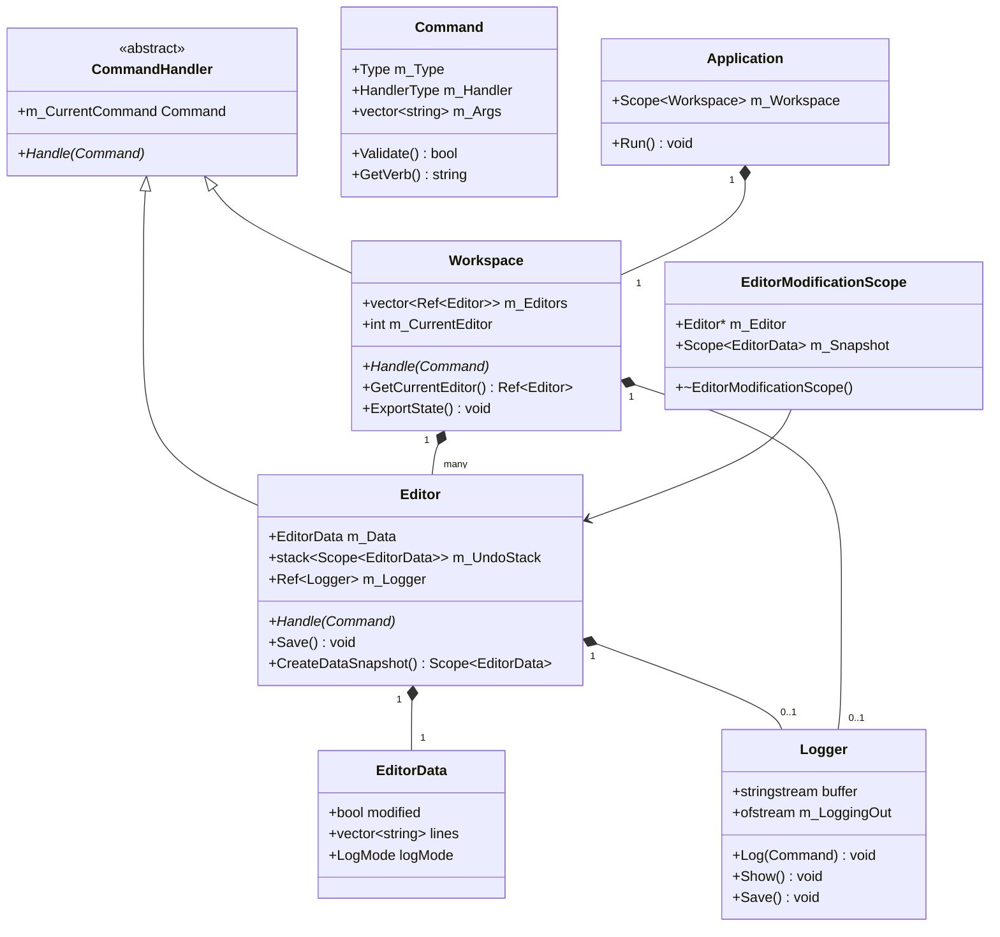
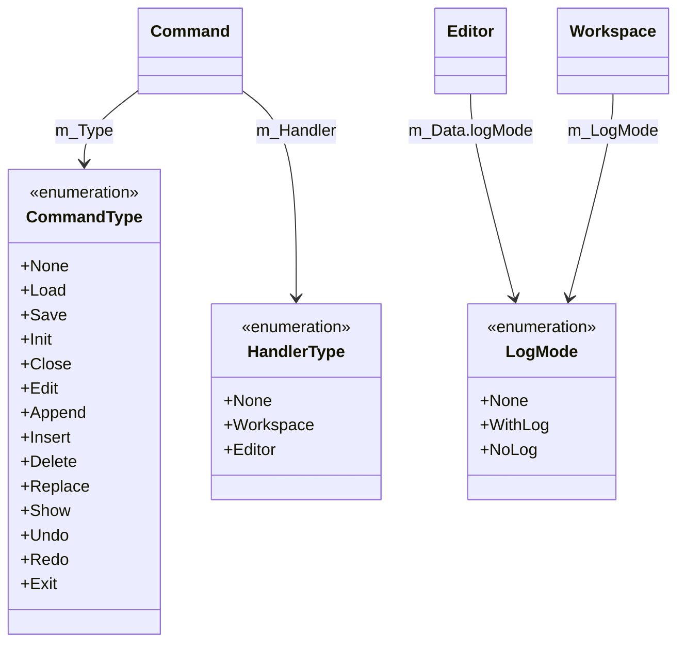
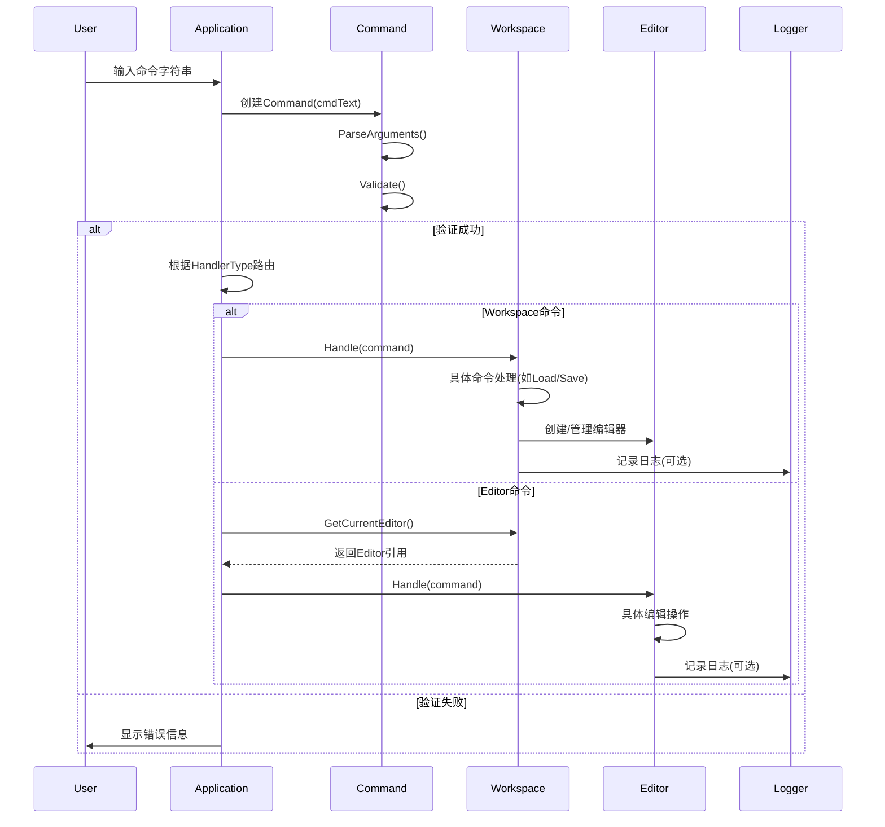
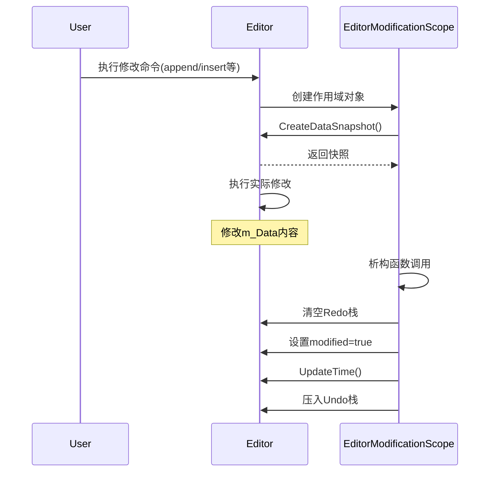
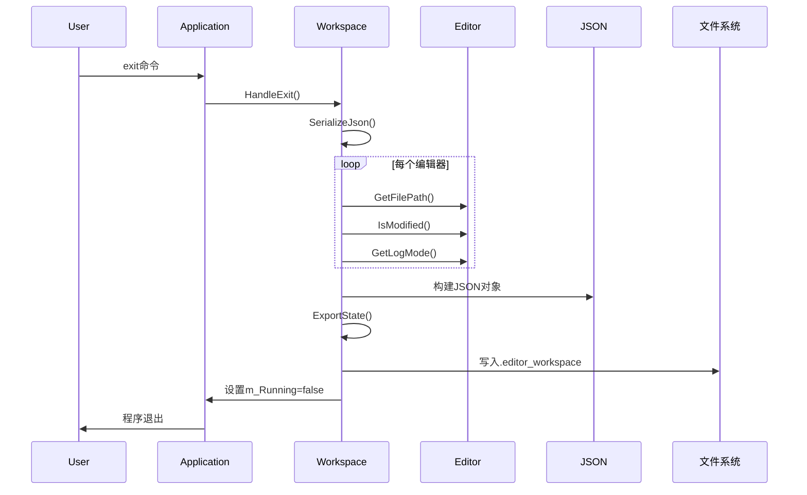
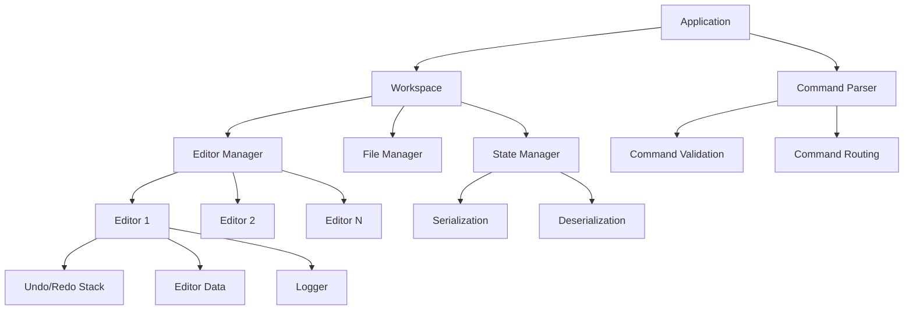
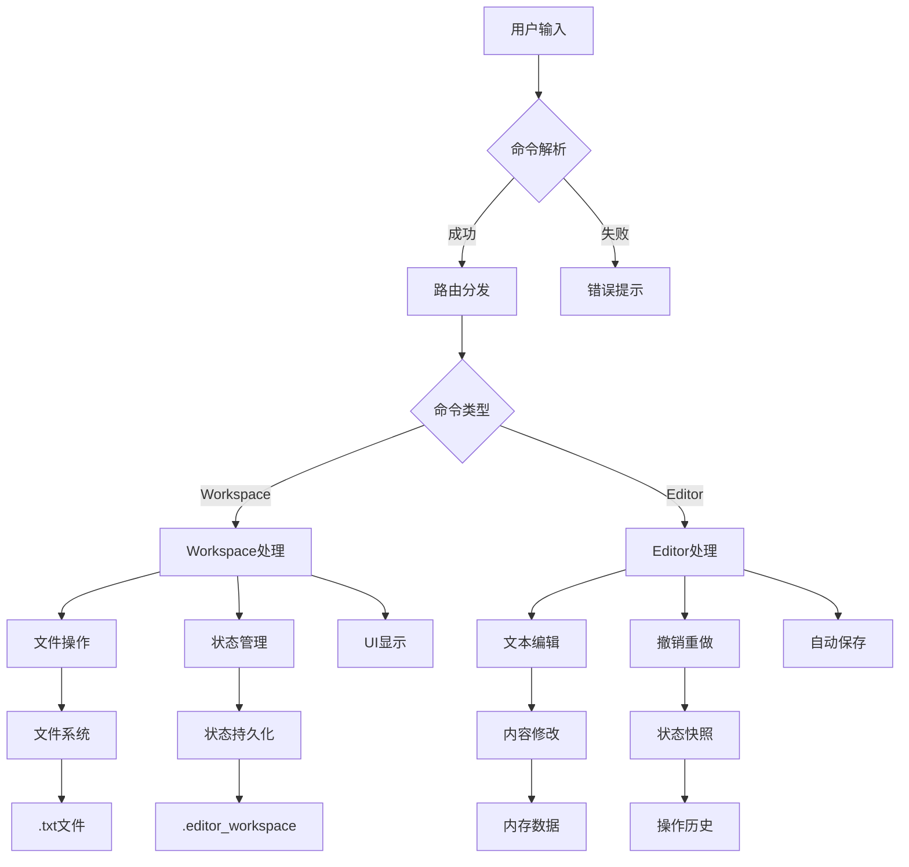
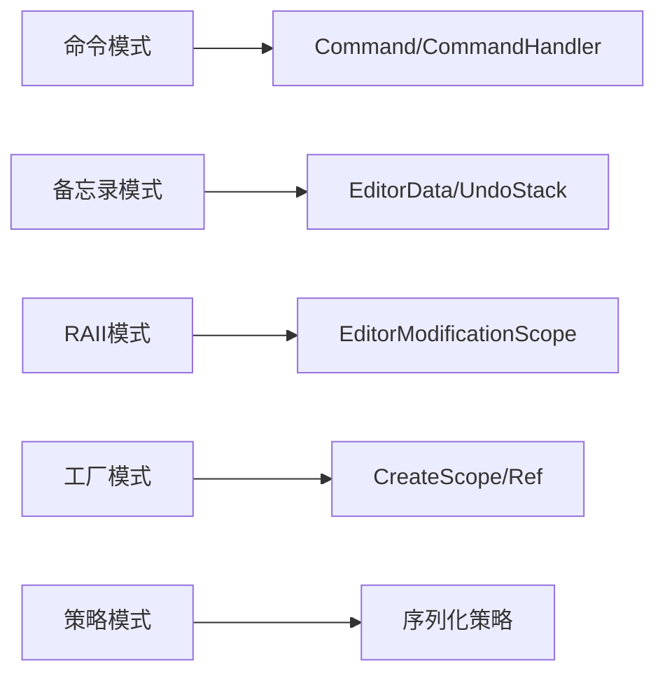

### 1. 核心类关系图

```mermaid
classDiagram
    class CommandHandler {
        <<abstract>>
        +Handle(Command)*
        +m_CurrentCommand Command
    }

    class Command {
        +Type m_Type
        +HandlerType m_Handler
        +vector~string~ m_Args
        +Validate() bool
        +GetVerb() string
    }

    class Workspace {
        +vector~Ref~Editor~~ m_Editors
        +int m_CurrentEditor
        +Handle(Command)*
        +GetCurrentEditor() Ref~Editor~
        +ExportState() void
    }

    class Editor {
        +EditorData m_Data
        +stack~Scope~EditorData~~ m_UndoStack
        +Ref~Logger~ m_Logger
        +Handle(Command)*
        +Save() void
        +CreateDataSnapshot() Scope~EditorData~
    }

    class EditorData {
        +bool modified
        +vector~string~ lines
        +LogMode logMode
    }

    class Logger {
        +stringstream buffer
        +ofstream m_LoggingOut
        +Log(Command) void
        +Show() void
        +Save() void
    }

    class Application {
        +Scope~Workspace~ m_Workspace
        +Run() void
    }

    class EditorModificationScope {
        +Editor* m_Editor
        +Scope~EditorData~ m_Snapshot
        +~EditorModificationScope()
    }

    CommandHandler <|-- Workspace
    CommandHandler <|-- Editor
    Workspace "1" *-- "many" Editor
    Editor "1" *-- "1" EditorData
    Editor "1" *-- "0..1" Logger
    Workspace "1" *-- "0..1" Logger
    Application "1" *-- "1" Workspace
    EditorModificationScope --> Editor
```

### 2. 枚举和类型定义

```mermaid
classDiagram
    class CommandType {
        <<enumeration>>
        +None
        +Load
        +Save
        +Init
        +Close
        +Edit
        +Append
        +Insert
        +Delete
        +Replace
        +Show
        +Undo
        +Redo
        +Exit
    }

    class HandlerType {
        <<enumeration>>
        +None
        +Workspace
        +Editor
    }

    class LogMode {
        <<enumeration>>
        +None
        +WithLog
        +NoLog
    }

    Command --> CommandType : m_Type
    Command --> HandlerType : m_Handler
    Editor --> LogMode : m_Data.logMode
    Workspace --> LogMode : m_LogMode
```

## 时序图

### 1. 应用启动和命令处理流程

```mermaid
sequenceDiagram
    participant User
    participant Application
    participant Command
    participant Workspace
    participant Editor
    participant Logger

    User->>Application: 输入命令字符串
    Application->>Command: 创建Command(cmdText)
    Command->>Command: ParseArguments()
    Command->>Command: Validate()
    
    alt 验证成功
        Application->>Application: 根据HandlerType路由
        
        alt Workspace命令
            Application->>Workspace: Handle(command)
            Workspace->>Workspace: 具体命令处理(如Load/Save)
            Workspace->>Editor: 创建/管理编辑器
            Workspace->>Logger: 记录日志(可选)
        else Editor命令
            Application->>Workspace: GetCurrentEditor()
            Workspace-->>Application: 返回Editor引用
            Application->>Editor: Handle(command)
            Editor->>Editor: 具体编辑操作
            Editor->>Logger: 记录日志(可选)
        end

    else 验证失败
        Application->>User: 显示错误信息
    end
```

### 2. 编辑器修改操作流程

```mermaid
sequenceDiagram
    participant User
    participant Editor
    participant EditorModificationScope

    User->>Editor: 执行修改命令(append/insert等)
    Editor->>EditorModificationScope: 创建作用域对象
    EditorModificationScope->>Editor: CreateDataSnapshot()
    Editor-->>EditorModificationScope: 返回快照
    
    Editor->>Editor: 执行实际修改
    Note over Editor: 修改m_Data内容
    
    EditorModificationScope->>EditorModificationScope: 析构函数调用
    EditorModificationScope->>Editor: 清空Redo栈
    EditorModificationScope->>Editor: 设置modified=true
    EditorModificationScope->>Editor: UpdateTime()
    EditorModificationScope->>Editor: 压入Undo栈
```

### 3. 工作区状态持久化流程

```mermaid
sequenceDiagram
    participant User
    participant Application
    participant Workspace
    participant Editor
    participant JSON

    User->>Application: exit命令
    Application->>Workspace: HandleExit()
    
    Workspace->>Workspace: SerializeJson()
    loop 每个编辑器
        Workspace->>Editor: GetFilePath()
        Workspace->>Editor: IsModified()
        Workspace->>Editor: GetLogMode()
    end
    
    Workspace->>JSON: 构建JSON对象
    Workspace->>Workspace: ExportState()
    Workspace->>文件系统: 写入.editor_workspace
    
    Workspace->>Application: 设置m_Running=false
    Application->>User: 程序退出
```

## 架构组件图

### 1. 系统组件关系

```mermaid
graph TB
    A[Application] --> B[Workspace]
    A --> C[Command Parser]
    
    B --> D[Editor Manager]
    B --> E[File Manager]
    B --> F[State Manager]
    
    D --> G[Editor 1]
    D --> H[Editor 2]
    D --> I[Editor N]
    
    G --> J[Undo/Redo Stack]
    G --> K[Editor Data]
    G --> L[Logger]
    
    C --> M[Command Validation]
    C --> N[Command Routing]
    
    F --> O[Serialization]
    F --> P[Deserialization]
```

### 2. 数据流图

```mermaid
flowchart TD
    A[用户输入] --> B{命令解析}
    B -->|成功| C[路由分发]
    B -->|失败| D[错误提示]
    
    C --> E{命令类型}
    E -->|Workspace| F[Workspace处理]
    E -->|Editor| G[Editor处理]
    
    F --> H[文件操作]
    F --> I[状态管理]
    F --> J[UI显示]
    
    G --> K[文本编辑]
    G --> L[撤销重做]
    G --> M[自动保存]
    
    H --> N[文件系统]
    I --> O[状态持久化]
    K --> P[内容修改]
    L --> Q[状态快照]
    
    N --> R[.txt文件]
    O --> S[.editor_workspace]
    P --> T[内存数据]
    Q --> U[操作历史]
```

## 设计模式应用图

```mermaid
graph LR
    A[命令模式] --> B[Command/CommandHandler]
    C[备忘录模式] --> D[EditorData/UndoStack]
    E[RAII模式] --> F[EditorModificationScope]
    G[工厂模式] --> H[CreateScope/Ref]
    I[策略模式] --> J[序列化策略]
```